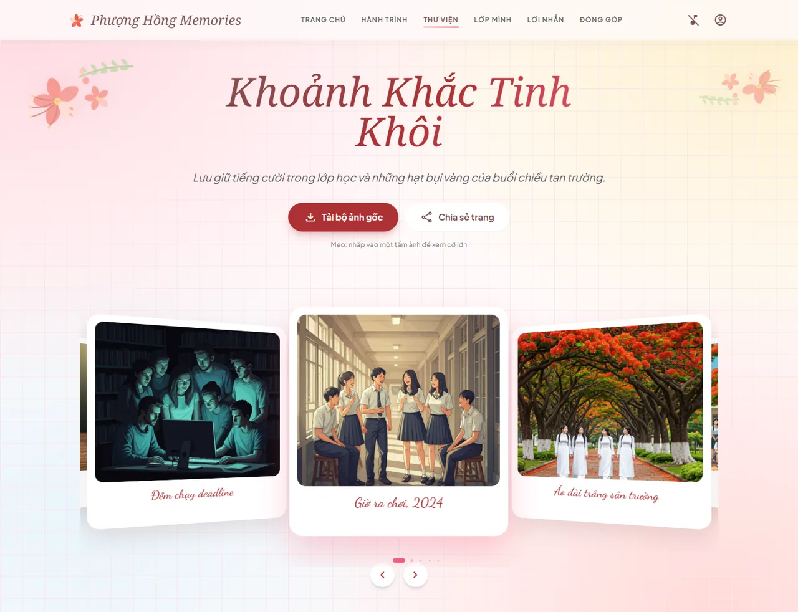

# 🌺 Phượng Hồng Memories

**A digital yearbook for class 12A1, Mạc Đĩnh Chi High School** — a single scrollable page holding a photo archive, a three-year timeline, student and teacher profiles, a shared message board, and a hand-authored animated SVG scene of the schoolyard.

**Kỷ yếu điện tử của lớp 12A1, trường THPT Mạc Đĩnh Chi** — một trang cuộn liền mạch gồm thư viện ảnh, hành trình ba năm, hồ sơ học sinh và thầy cô, bảng lời nhắn chung, và tranh động sân trường vẽ tay hoàn toàn bằng SVG.

   -3b82f6)

**[English](#english) · [Tiếng Việt](#tiếng-việt)** · [Engineering docs](docs/README.md)

---

## Screenshots


<p align="center"><em>Trang chủ · Home</em></p>


<p align="center"><em>Tranh sân trường vẽ tay hoàn toàn bằng SVG, không dùng ảnh bitmap · The schoolyard scene, hand-authored entirely in SVG with no raster assets</em></p>



<p align="center"><em>Thư viện ảnh · Gallery</em></p>

> Ảnh trong thư viện hiện là ảnh tạm do AI sinh, sẽ thay bằng ảnh thật của lớp.
> Gallery photographs are temporary AI-generated placeholders, pending the class's own images.

---

# English

## Status

This is an honest picture of where the project stands.

| Part | State |
| --- | --- |
| **Front-end** | **Working preview build.** One hand-written HTML file, no build step, all data simulated in the browser |
| **Back-end** | **Fully designed, not implemented.** `server/` is empty; the contract and schema are written |
| **Engineering docs** | **Complete.** BRD → PRD → SRS → HLD → LLD, plus tech stack, storage, security and build guide |
| **Photographs** | Temporary AI-generated placeholders — must be replaced before publishing |

The production build is a React front-end against a Spring Boot API. The current HTML file is a design preview, deliberately kept until the real client replaces it section by section.

## Tech stack

| Layer | Now (preview) | Planned (production) |
| --- | --- | --- |
| Front-end | One HTML file · Tailwind Play CDN · GSAP · Swiper | React 19 · TypeScript · Vite · Tailwind (bundled) |
| Back-end | — | Java LTS · Spring Boot · Spring Security 6 |
| Database | `localStorage` | PostgreSQL · Flyway |
| Cache / sessions | — | Redis · Bucket4j |
| Object storage | — | Cloudflare R2 (MinIO in dev) |
| Image processing | — | libvips |
| Infrastructure | — | Docker Compose · Caddy · Cloudflare · Prometheus |

Why each of these — and the list of technologies deliberately **not** used — is in [`docs/MemoryBook-TechStack.md`](docs/MemoryBook-TechStack.md).

## Repository layout

| Directory | Contents | Status | Documentation |
| --- | --- | --- | --- |
| [`client/`](client/) | The web application — one self-contained HTML file, no build step | Working | [`client/README.md`](client/README.md) |
| [`server/`](server/) | REST API for shared messages and photo contributions | Designed, not implemented | [`server/README.md`](server/README.md) |
| [`docs/`](docs/) | Engineering documents — BRD, PRD, SRS, HLD, LLD, tech stack, storage, security, workflow, build guide | Complete | [`docs/README.md`](docs/README.md) |

Each directory documents itself. To read code, start with the front-end guide. To understand the system, start with [`docs/`](docs/README.md).

## Engineering notes

The interesting problems in this project are not the CRUD. A few decisions and why they were made:

- **Photographs reach 25 MB and the archive reaches 20 GB.** Uploads therefore never pass through the application server — the client requests a presigned URL and writes directly to object storage. Magic bytes are then checked with a `GET Range: bytes=0-31` request, fetching 32 bytes instead of 25 MB. → [Storage §4](docs/MemoryBook-Storage-Media.md)
- **`ImageIO` cannot be used at this scale.** A 50-megapixel photograph decodes to roughly 200 MB of heap, for one image. libvips streams instead, and its memory use is nearly independent of input size. → [Storage §5](docs/MemoryBook-Storage-Media.md)
- **Object storage was chosen on egress price, not storage price.** One round of the class downloading the album is 160 GB of traffic: $0 on Cloudflare R2, roughly $15 on S3. → [Storage §3](docs/MemoryBook-Storage-Media.md)
- **Originals and published variants live in separate, differently-permissioned zones.** Originals carry GPS coordinates; serving them publicly would leak where students were photographed. → [HLD §3.7](docs/MemoryBook-HLD.md)
- **Nothing a visitor submits is published without a human approving it.** Submissions return `202`, never `201`, and the interface says so rather than pretending otherwise. → [HLD §5, DD6](docs/MemoryBook-HLD.md)
- **The audit log is append-only at the database level**, not by convention: `REVOKE UPDATE, DELETE ON audit_logs`. The difference matters exactly when the application itself is compromised. → [LLD §2.2](docs/MemoryBook-LLD.md)

The full threat model and an OWASP Top 10 walkthrough are in [`docs/MemoryBook-Security.md`](docs/MemoryBook-Security.md).

## Quick start

The front-end runs on its own with no back-end. It needs an internet connection for the CDN libraries, fonts and photographs.

```bash
cd client
python -m http.server 5173
```

Then open `http://localhost:5173`.

Building the back-end from scratch: [`docs/MemoryBook-Build-Guide.md`](docs/MemoryBook-Build-Guide.md).

## Deploying

The two halves deploy independently even though they share one repository — set the host's **root directory** for each.

| Part | Host | Root directory |
| --- | --- | --- |
| Front-end | Vercel, Netlify, Cloudflare Pages | `client` |
| Back-end | Railway, Render, Fly.io, or a VPS | `server` |

Vercel cannot run Spring Boot — its functions support Node.js, Python, Go and Ruby, not Java. The back-end needs a host that runs a Docker image.

## Before publishing

*A note to myself, kept in the open. Nothing here is asked of anyone reading the repository — these are the conditions this site has to meet before it goes live with the class's real photographs.*

- Replace the 32 placeholder photographs with the class's own images.
- Ask the class before publishing anything. Several people in these photographs were minors when they were taken.
- Decide deliberately whether the site is fully public or link-only. A yearbook gains almost nothing from being reachable by the whole internet.
- Work through the go-live checklist in [`docs/MemoryBook-Security.md`](docs/MemoryBook-Security.md) §11.

## Licence

Code is MIT. **Photographs, personal names and school identity are not** — they are personal data and all rights are reserved. See [`LICENSE`](LICENSE).

---

# Tiếng Việt

## Trạng thái

Đây là bức tranh thật về tình trạng dự án.

| Phần | Tình trạng |
| --- | --- |
| **Front-end** | **Bản dựng tạm đang chạy được.** Một file HTML viết tay, không có bước build, dữ liệu mô phỏng trong trình duyệt |
| **Back-end** | **Đã thiết kế xong, chưa hiện thực.** `server/` đang trống; hợp đồng API và lược đồ dữ liệu đã viết |
| **Tài liệu kỹ thuật** | **Hoàn chỉnh.** BRD → PRD → SRS → HLD → LLD, cộng tech stack, lưu trữ, bảo mật và hướng dẫn dựng |
| **Ảnh** | Ảnh tạm do AI sinh — phải thay trước khi công bố |

Bản chính thức là front-end React nối vào API Spring Boot. File HTML hiện tại là bản xem trước về thiết kế, cố ý giữ lại cho tới khi client thật thay thế dần từng phần.

## Công nghệ

| Tầng | Hiện tại (bản tạm) | Dự kiến (bản chính thức) |
| --- | --- | --- |
| Front-end | Một file HTML · Tailwind Play CDN · GSAP · Swiper | React 19 · TypeScript · Vite · Tailwind (đóng gói) |
| Back-end | — | Java LTS · Spring Boot · Spring Security 6 |
| Cơ sở dữ liệu | `localStorage` | PostgreSQL · Flyway |
| Cache / phiên | — | Redis · Bucket4j |
| Kho đối tượng | — | Cloudflare R2 (MinIO khi phát triển) |
| Xử lý ảnh | — | libvips |
| Hạ tầng | — | Docker Compose · Caddy · Cloudflare · Prometheus |

Lý do chọn từng thứ — và danh sách công nghệ **cố tình không dùng** — nằm ở [`docs/MemoryBook-TechStack.md`](docs/MemoryBook-TechStack.md).

## Cấu trúc kho mã

| Thư mục | Nội dung | Trạng thái | Tài liệu |
| --- | --- | --- | --- |
| [`client/`](client/) | Ứng dụng web — một file HTML duy nhất, không cần build | Đang chạy được | [`client/README.md`](client/README.md) |
| [`server/`](server/) | API cho bảng lời nhắn chung và việc đóng góp ảnh | Đã thiết kế, chưa hiện thực | [`server/README.md`](server/README.md) |
| [`docs/`](docs/) | Tài liệu kỹ thuật — BRD, PRD, SRS, HLD, LLD, tech stack, lưu trữ, bảo mật, quy trình, hướng dẫn dựng | Hoàn chỉnh | [`docs/README.md`](docs/README.md) |

Mỗi thư mục có tài liệu riêng. Muốn đọc mã thì bắt đầu từ hướng dẫn front-end. Muốn hiểu hệ thống thì bắt đầu từ [`docs/`](docs/README.md).

## Ghi chú kỹ thuật

Phần đáng nói của dự án này không nằm ở CRUD. Vài quyết định và lý do đằng sau:

- **Ảnh tới 25 MB và tổng kho tới 20 GB.** Vì vậy ảnh tải lên không bao giờ đi qua máy chủ ứng dụng — client xin đường dẫn ký sẵn và ghi thẳng vào kho đối tượng. Magic bytes sau đó được kiểm bằng yêu cầu `GET Range: bytes=0-31`, tức tải về 32 byte thay vì 25 MB. → [Storage mục 4](docs/MemoryBook-Storage-Media.md)
- **`ImageIO` không dùng được ở quy mô này.** Một ảnh 50 megapixel giải mã ra khoảng 200 MB heap, cho **một** ảnh. libvips xử lý theo luồng, bộ nhớ gần như không phụ thuộc kích thước đầu vào. → [Storage mục 5](docs/MemoryBook-Storage-Media.md)
- **Kho lưu trữ được chọn theo giá egress, không phải giá lưu trữ.** Một đợt cả lớp tải album là 160 GB lưu lượng: 0 đồng trên Cloudflare R2, khoảng 380.000 đồng trên S3. → [Storage mục 3](docs/MemoryBook-Storage-Media.md)
- **Ảnh gốc và biến thể công bố nằm ở hai vùng có quyền truy cập khác nhau.** Ảnh gốc mang theo toạ độ GPS; phục vụ ra công khai là làm lộ nơi học sinh được chụp ảnh. → [HLD mục 3.7](docs/MemoryBook-HLD.md)
- **Không có thứ gì khách gửi được công bố mà chưa qua người thật duyệt.** Phản hồi trả `202`, không bao giờ `201`, và giao diện nói thẳng điều đó thay vì giả vờ ngược lại. → [HLD mục 5, DD6](docs/MemoryBook-HLD.md)
- **Nhật ký kiểm toán chỉ được thêm mới, ép ở tầng cơ sở dữ liệu** chứ không phải bằng quy ước: `REVOKE UPDATE, DELETE ON audit_logs`. Khác biệt này quan trọng đúng vào lúc chính ứng dụng bị chiếm. → [LLD mục 2.2](docs/MemoryBook-LLD.md)

Mô hình đe doạ đầy đủ và phần đối chiếu OWASP Top 10 nằm ở [`docs/MemoryBook-Security.md`](docs/MemoryBook-Security.md).

## Chạy nhanh

Phần front-end chạy độc lập, không cần back-end. Trang cần kết nối internet để tải thư viện CDN, phông chữ và ảnh.

```bash
cd client
python -m http.server 5173
```

Sau đó mở `http://localhost:5173`.

Dựng back-end từ đầu: [`docs/MemoryBook-Build-Guide.md`](docs/MemoryBook-Build-Guide.md).

## Triển khai

Hai phần deploy độc lập được dù nằm chung một kho mã — chỉ cần đặt **root directory** cho từng bên ở nơi triển khai.

| Phần | Nơi triển khai | Root directory |
| --- | --- | --- |
| Front-end | Vercel, Netlify, Cloudflare Pages | `client` |
| Back-end | Railway, Render, Fly.io, hoặc VPS | `server` |

Vercel không chạy được Spring Boot — functions của nó hỗ trợ Node.js, Python, Go và Ruby, không có Java. Back-end cần nơi chạy được image Docker.

## Trước khi công bố

*Ghi chú cho chính mình, để công khai luôn. Người đọc kho mã không phải làm gì ở đây cả — đây là những điều kiện trang này phải đạt trước khi lên thật với ảnh của lớp.*

- Thay 32 ảnh tạm bằng ảnh thật của lớp.
- Hỏi ý kiến cả lớp trước khi công bố. Nhiều người trong những tấm ảnh này còn ở tuổi vị thành niên tại thời điểm chụp.
- Quyết định dứt khoát: công khai hoàn toàn hay chỉ ai có đường dẫn mới xem được. Một cuốn kỷ yếu gần như không được lợi gì từ việc cả internet vào xem được.
- Đi hết checklist trước khi công bố ở [`docs/MemoryBook-Security.md`](docs/MemoryBook-Security.md) mục 11.

## Giấy phép

Mã nguồn theo MIT. **Ảnh, tên cá nhân và danh tính nhà trường thì không** — đó là dữ liệu cá nhân và giữ toàn bộ quyền. Xem [`LICENSE`](LICENSE).
